# 🚀 LangFlow - AI-Powered Security Automation Platform

<div align="center">


**Next-Generation Cybersecurity Workflow Automation with Virtual Playground**

[](https://opensource.org/licenses/MIT)
[](https://www.python.org/downloads/)
[](https://reactjs.org/)
[](https://fastapi.tiangolo.com/)
[](https://www.docker.com/)

*Automate your security workflows with AI-powered intelligence, real-time execution monitoring, and isolated virtual environments*

</div>

---

## 🎯 **Overview**

LangFlow is a cutting-edge cybersecurity automation platform that combines the power of AI with traditional security tools and isolated virtual environments. Create sophisticated pentesting workflows that seamlessly blend command-line tools, AI analysis, multi-channel reporting, and hands-on testing in secure Docker containers.

### ✨ **Key Features**

#### 🤖 **AI-Powered Analysis**
- **Multi-Model Support**: OpenAI GPT-4o, GPT-4o-mini, GPT-3.5-turbo
- **Intelligent Context**: AI steps can reference previous outputs and workflow variables
- **Custom Prompts**: Template-based prompting with dynamic variable substitution

#### ⚡ **Command Execution**
- **Shell Integration**: Execute any command-line security tools
- **Variable Templating**: Dynamic command generation with context variables
- **Cross-Platform**: Windows PowerShell and Unix shell support
- **Timeout Control**: Configurable execution timeouts per step

#### 🐳 **Virtual Playground (NEW!)**
- **Docker-in-Docker (DIND)**: Isolated containerized environments for safe testing
- **Interactive Web Terminal**: Full xterm.js-powered terminal with Linux shell
- **Pre-installed Security Tools**: nmap, tcpdump, netcat, iptables, curl, wget, git, python3, nodejs
- **Persistent Workspaces**: Named volumes for data persistence across sessions
- **Real-time Monitoring**: CPU, memory, network, and container usage statistics
- **Auto-cleanup**: Automatic container lifecycle management with configurable expiration
- **Multi-session Support**: Multiple concurrent terminal sessions per playground

#### 📧 **Multi-Channel Reporting**
- **Email (SMTP)**: Professional reports via any SMTP server
- **Telegram Bot**: Real-time alerts and notifications
- **Slack Integration**: Team collaboration with webhook support
- **Template System**: Rich report templates with variable substitution

#### 🎨 **Visual Workflow Builder**
- **Node-Based Design**: Drag-and-drop workflow creation
- **Real-Time Preview**: Visual representation of workflow execution
- **Step Dependencies**: Define execution order and relationships
- **Template Library**: Pre-built workflows for common scenarios

#### 📊 **Real-Time Monitoring**
- **Live Execution Logs**: WebSocket-powered real-time updates
- **Progress Tracking**: Visual indicators for step completion
- **Interactive Terminal**: Full web-based TTY for manual operations
- **Execution History**: Complete audit trail of all runs
- **Playground Stats**: Real-time resource monitoring for virtual environments

#### 📈 **Analytics Dashboard**
- **Execution Statistics**: Success rates, duration metrics, trend analysis
- **Visual Charts**: Interactive graphs and performance indicators
- **Workflow-Specific Metrics**: Filtered analytics per workflow
- **Historical Trends**: 7-day activity tracking
- **Playground Usage**: Resource utilization and container statistics

#### 📄 **AI-Powered Report Generation**
- **ChatGPT Integration**: Intelligent analysis and summarization
- **Professional PDF Reports**: Enterprise-ready documentation
- **Markdown Processing**: Rich formatting from AI responses
- **Executive Summaries**: Business-appropriate reporting
- **Risk Assessment**: Automated security posture evaluation
- **Multiple Report Formats**: PDF download with comprehensive analysis

---

## 🔄 **Complete Workflow Execution Diagram**

```mermaid
graph TB
    A["🚀 LangFlow Platform"] --> B["📝 Workflow Creation"]
    A --> C["📊 Execution & Monitoring"] 
    A --> D["📄 Report Generation"]
    A --> E["🖥️ Terminal Operations"]
    A --> F["🐳 Virtual Playground"]
    
    B --> B1["🛠️ WorkflowForm"]
    B --> B2["🎨 Visual Builder"]
    B1 --> B3["⚡ Command Steps"]
    B1 --> B4["🤖 AI Steps"]
    B1 --> B5["📧 Report Steps"]
    B3 --> B6["📥 Input Variables"]
    B4 --> B6
    B5 --> B6
    
    C --> C1["🏃 Workflow Engine"]
    C1 --> C2["⚡ Command Execution"]
    C1 --> C3["🤖 AI Processing"]
    C1 --> C4["📧 Multi-channel Delivery"]
    C2 --> C5["📊 Real-time Updates"]
    C3 --> C5
    C4 --> C5
    
    D --> D1["📄 AI Report Generator"]
    D1 --> D2["🤖 ChatGPT Analysis"]
    D2 --> D3["📝 Markdown Processing"]
    D3 --> D4["📊 Professional PDF"]
    D4 --> D5["📥 Download Management"]
    
    E --> E1["🖥️ Interactive Terminal"]
    E1 --> E2["🔄 Xterm Integration"]
    E2 --> E3["📊 Command History"]
    E3 --> E4["🔍 Full-screen UI"]
    
    F --> F1["🐳 DIND Container"]
    F1 --> F2["🖥️ Web Terminal"]
    F1 --> F3["📊 Resource Monitor"]
    F1 --> F4["🛠️ Security Tools"]
    F2 --> F5["⚡ WebSocket Communication"]
    F3 --> F6["📈 Real-time Stats"]
    F4 --> F7["🔧 Pre-installed Tools"]
    
    B6 --> C1
    C5 --> D1
    E4 --> C1
    F5 --> C1
    F6 --> C5
    
    style A fill:#0f1325,stroke:#22d3ee,color:#fff
    style B fill:#ec4899,stroke:#ec4899,color:#fff
    style C fill:#10b981,stroke:#10b981,color:#fff
    style D fill:#f59e0b,stroke:#f59e0b,color:#fff
    style E fill:#8b5cf6,stroke:#8b5cf6,color:#fff
    style F fill:#ef4444,stroke:#ef4444,color:#fff
```



### 🔄 **Simplified Process Flow**


## 🏗️ **Architecture**

### **Frontend Stack**
- **React 18** with TypeScript for type-safe development
- **Vite** for lightning-fast development and builds
- **Tailwind CSS** with custom cyberpunk theme
- **React Flow** for visual workflow building
- **xterm.js** for web-based terminal emulation
- **Recharts** for data visualization

### **Backend Stack**
- **FastAPI** for high-performance async API
- **LangChain** for AI model orchestration
- **OpenAI API** integration with multiple model support
- **WebSocket** support for real-time communication
- **Pydantic** for robust data validation
- **Docker Engine** for containerized virtual environments
- **Docker-in-Docker (DIND)** for isolated playground instances
- **Asyncio** for concurrent task management

### **Key Libraries & Tools**
- **Drag & Drop**: `@hello-pangea/dnd` for workflow reordering
- **CSV Processing**: `papaparse` for data table rendering
- **HTTP Client**: `httpx` for async API calls
- **Email**: Built-in SMTP support with TLS
- **Security**: Environment-based configuration
- **PDF Generation**: `reportlab` for enterprise-ready reports
- **Terminal Enhancement**: `@xterm/addon-fit` for responsive terminal

---

## 🚀 **Quick Start**

### **Prerequisites**
- Python 3.8+ 
- Node.js 18+ or Bun
- OpenAI API key
- **Docker Engine** (for Virtual Playground feature)
- **Docker Compose** (optional, for easier deployment)

> 🐳 **Docker Requirements**: The Virtual Playground feature requires Docker Engine to be running on the host system. Make sure Docker is installed and the Docker daemon is accessible.

### **Backend Setup**

1. **Environment Configuration**
   ```bash
   cd backend
   cp .env.example .env
   # Edit .env and add your OPENAI_API_KEY
   ```

2. **Virtual Environment & Dependencies**
   ```bash
   # Windows PowerShell
   python -m venv .venv
   .\.venv\Scripts\Activate.ps1
   pip install -r requirements.txt
   
   # Linux/macOS
   python -m venv .venv
   source .venv/bin/activate
   pip install -r requirements.txt
   
   # Additional dependencies for PDF reports
   pip install reportlab>=4.0.0
   ```

3. **Docker Setup (for Virtual Playground)**
   ```bash
   # Verify Docker is running
   docker version
   docker info
   
   # Pull required base images
   docker pull docker:dind
   docker pull alpine:latest
   
   # Create Docker network for playground instances (optional)
   docker network create langflow-playground --driver bridge
   ```

4. **Start API Server**
   ```bash
   uvicorn app.main:app --reload --port 8000
   ```

### **Frontend Setup**

**With Bun (Recommended)**
```bash
cd frontend
bun install
bun run dev
```

**With Node.js**
```bash
cd frontend
npm install
npm run dev
```

🌐 **Access the app**: http://localhost:5173

---

## 🖼️ **Screenshots & Demo**

### **🎬 Platform Overview**
- 🚀 **Dashboard**: Cyberpunk-themed interface with real-time statistics
- 🛠️ **Workflow Builder**: Visual drag-and-drop workflow creation
- 📊 **Execution Monitor**: Live progress tracking with WebSocket updates
- 🖥️ **Interactive Terminal**: Full-featured web terminal with command history
- 📄 **AI Reports**: Professional PDF generation with ChatGPT analysis

### **🔗 Live Demo**
> 🚧 **Coming Soon**: Interactive demo environment with sample workflows

### **📸 Feature Gallery**
```
┌─ 🎨 Cyberpunk UI ─────────────────────────────────────┐
│ • Dark theme with neon accent colors                  │
│ • Responsive design for all screen sizes              │
│ • Smooth animations and glowing effects               │
└────────────────────────────────────────────────────────┘

┌─ 🤖 AI Integration ────────────────────────────────────┐
│ • ChatGPT-4o powered analysis and decision making     │
│ • Dynamic prompt templating with variables            │
│ • Intelligent report generation and summarization     │
└────────────────────────────────────────────────────────┘

┌─ 📊 Professional Reports ──────────────────────────────┐
│ • Executive summaries with risk assessment            │
│ • Technical analysis with step-by-step breakdown      │
│ • Markdown formatting converted to PDF styling        │
│ • Enterprise-ready documentation standards            │
└────────────────────────────────────────────────────────┘
```

---

## 🎮 **Usage Guide**

### **1. Create Your First Workflow**

#### **Using Templates**
Choose from pre-built templates:
- 🔍 **Basic Reconnaissance**: Subdomain discovery + port scanning
- 🌐 **Web Application Testing**: Directory fuzzing + vulnerability analysis  
- 🔗 **Network Assessment**: Network discovery + service enumeration

#### **Custom Workflow**
1. Click "Create Workflow"
2. Add steps using the step buttons:
   - 🤖 **AI Step**: For intelligent analysis and decision making
   - ⚡ **Command Step**: For executing security tools
   - 📧 **Report Step**: For sending results via email/Telegram/Slack

### **2. Configure Workflow Steps**

#### **AI Steps**
```yaml
Name: Vulnerability Analysis
Prompt: "Analyze the nmap results and identify critical vulnerabilities in {target}"
Model: GPT-4o-mini
Variables: {target}, {nmap_results}
```

#### **Command Steps**
```yaml
Name: Port Scan
Command: "nmap -sV -sC {target}"
Timeout: 300 seconds
Variables: {target}
```

#### **Report Steps**
```yaml
Name: Send Security Report
Subject: "Security Assessment - {target}"
Template: |
  Security scan completed for {target}
  
  Findings:
  {Vulnerability Analysis}
  
  Generated by LangFlow
Channels:
  - Email: SMTP configuration
  - Telegram: Bot token + chat IDs
  - Slack: Webhook URL
```

### **3. Execute & Monitor**

1. **Start Execution**: Click "Run" to begin workflow
2. **Real-Time Monitoring**: Watch live logs and progress
3. **Interactive Terminal**: Access web TTY for manual commands
4. **View Results**: Check execution history and reports

### **4. Virtual Playground Usage**

#### **🐳 Create Playground Instance**
1. **Navigate to Playground**: Click "Virtual Playground" in the main menu
2. **Create New Instance**: 
   ```
   • Name: Optional custom name for identification
   • Duration: 4-8 hours (auto-cleanup after expiration)
   • Resources: Automatic allocation of ports and volumes
   ```
3. **Wait for Initialization**: Container setup with DIND takes 1-2 minutes

#### **🖥️ Interactive Terminal**
- **Web-based Terminal**: Full xterm.js terminal with Linux shell
- **Pre-installed Tools**: 
  ```bash
  # Security tools
  nmap -sn 192.168.1.0/24
  tcpdump -i eth0
  netcat -l -p 8080
  
  # Development tools  
  python3 --version
  node --version
  git --version
  
  # Network utilities
  curl -I https://example.com
  wget -O- https://api.github.com
  ```
- **Docker-in-Docker**: Run containers within the playground
  ```bash
  docker run hello-world
  docker ps
  docker images
  ```

#### **📊 Resource Monitoring**
- **Real-time Stats**: CPU, memory, network, disk usage
- **Container Count**: Active containers within playground
- **Session Management**: Multiple terminal sessions per instance
- **Auto-refresh**: Manual status refresh for installing instances

#### **🔧 Playground Management**
- **Extend Session**: Add 2+ hours to prevent auto-cleanup
- **Manual Cleanup**: Force cleanup of orphaned containers
- **Status Monitoring**: Real-time status updates (creating → installing → running → stopped)

### **5. Generate AI-Powered Reports**

1. **Access Run History**: Navigate to workflow details → "Show History"
2. **Select Run**: Choose the execution you want to analyze
3. **Generate Report**: Click "Generate PDF Report" for AI analysis
4. **Download Results**: Professional PDF with:
   - 🤖 **AI Executive Summary**: ChatGPT-powered analysis
   - 📊 **Technical Details**: Complete step-by-step breakdown
   - ⚠️ **Risk Assessment**: Automated security evaluation
   - 💡 **Recommendations**: Actionable security improvements
   - 📋 **Formal Documentation**: Enterprise-ready formatting

---

## 📁 **Project Structure**

```
lang-flow/
├── 📁 frontend/                 # React TypeScript app
│   ├── 📁 src/
│   │   ├── 📁 components/       # Reusable UI components
│   │   │   ├── WorkflowForm.tsx    # Workflow creation/editing
│   │   │   ├── WorkflowViewer.tsx  # Read-only workflow display
│   │   │   ├── RunView.tsx         # Real-time execution logs
│   │   │   ├── Dashboard.tsx       # Analytics & statistics
│   │   │   ├── Terminal.tsx        # Web-based terminal
│   │   │   ├── WorkflowBuilder.tsx # Visual node editor
│   │   │   ├── PlaygroundTerminal.tsx # Virtual playground terminal
│   │   │   └── PlaygroundInstanceCard.tsx # Playground instance display
│   │   ├── 📁 pages/            # Page components
│   │   │   ├── ScanPage.tsx        # Consolidated scan interface
│   │   │   └── PlaygroundPage.tsx  # Virtual playground management
│   │   ├── 📁 types/            # TypeScript definitions
│   │   └── 📁 api/              # API client functions
│   ├── tailwind.config.ts       # Cyberpunk theme configuration
│   └── package.json
├── 📁 backend/                  # Python FastAPI app
│   ├── 📁 app/
│   │   ├── 📁 models/           # Pydantic data models
│   │   ├── 📁 routers/          # API route handlers
│   │   │   ├── workflows.py        # Workflow CRUD operations
│   │   │   ├── runs.py            # Execution & WebSocket endpoints
│   │   │   ├── terminal.py        # Interactive terminal WebSocket
│   │   │   ├── playground.py      # Virtual playground management
│   │   │   └── reports.py         # PDF report generation endpoints
│   │   └── 📁 services/         # Business logic
│   │       ├── workflow_engine.py  # Core execution engine
│   │       ├── ai.py              # AI model integration
│   │       ├── command_executor.py # Shell command execution
│   │       ├── report_service.py   # Multi-channel reporting
│   │       ├── report_generator.py # AI-powered PDF generation
│   │       ├── playground_service.py # Docker playground management
│   │       ├── storage.py         # Data persistence
│   │       └── realtime.py        # WebSocket management
│   ├── 📁 data/                 # Data storage
│   │   ├── workflows.json          # Workflow definitions
│   │   ├── playground.json         # Playground instances
│   │   ├── 📁 runs/               # Execution results
│   │   ├── 📁 reports/            # Generated PDF reports
│   │   └── 📁 samples/            # Example workflows
│   └── requirements.txt
├── 📁 assets/                   # Project assets
│   └── logo.svg                 # Project logo
└── README.md
```

---

## 🎨 **Cyberpunk Theme**

LangFlow features a custom cyberpunk-inspired design with:

- **Neon Color Palette**: Electric cyan, green, pink, and yellow accents
- **Dark UI**: Deep space backgrounds with glowing elements
- **Typography**: Share Tech Mono font for that authentic hacker aesthetic
- **Animations**: Pulsing indicators, glowing shadows, and smooth transitions
- **Visual Effects**: Gradient backgrounds and neon glow effects

---

## 🔧 **Configuration**

### **Environment Variables**

```bash
# Backend (.env)
OPENAI_API_KEY=your-openai-api-key-here
CORS_ORIGINS=http://localhost:5173
PORT=8000
RUNS_DIR=data/runs
WORKFLOWS_FILE=data/workflows.json
PLAYGROUND_FILE=data/playground.json
REPORTS_DIR=data/reports
DEFAULT_MODEL_PROVIDER=openai
DEFAULT_MODEL_NAME=gpt-4o-mini

# Virtual Playground Configuration
DOCKER_HOST=unix:///var/run/docker.sock
PLAYGROUND_BASE_PORT=10000
PLAYGROUND_MAX_INSTANCES=10
PLAYGROUND_DEFAULT_DURATION_HOURS=4
PLAYGROUND_CLEANUP_INTERVAL_MINUTES=30
```

### **Report Channel Setup**

#### **Email (SMTP)**
```yaml
SMTP Server: smtp.gmail.com
Port: 587
Username: your-email@gmail.com
Password: your-app-password
TLS: Enabled
```

#### **Telegram Bot**
1. Create bot via @BotFather
2. Get bot token
3. Add bot to chat/channel
4. Get chat ID

#### **Slack Webhook**
1. Create Slack app
2. Enable incoming webhooks
3. Copy webhook URL

---

## 🛡️ **Security Considerations**

⚠️ **Important Security Notes**:

- **Command Execution**: LangFlow can execute arbitrary commands. Only run trusted workflows in controlled environments.
- **API Keys**: Store sensitive credentials in environment variables, never in workflow definitions.
- **Network Access**: Be cautious when running on production networks.
- **Input Validation**: Always validate and sanitize inputs from external sources.
- **Audit Trail**: All executions are logged for security auditing.

---

## 🔮 **Advanced Features**

### **Variable Templating**
Use dynamic variables in any step:
```yaml
# Reference previous steps
Command: "nmap -sV {target} | grep {Port Scan}"

# Use workflow metadata  
Subject: "Report for {workflow_name} - {target}"

# Access execution context
Template: "Scan completed at {started_at} for {target}"
```

### **WebSocket Real-Time Updates**
```javascript
// Frontend automatically connects to WebSocket for live updates
ws://localhost:8000/api/runs/ws/{run_id}

// Receives real-time events:
// - run_started
// - log (step progress)
// - run_finished
```

### **CSV Data Processing**
Automatically render CSV outputs as formatted tables:
```bash
# Command output in CSV format gets rendered as HTML table
nmap -oG - {target} | grep "open" | awk '{print $2","$4}'
```

### **AI-Powered Report Features**
Generate professional security reports with ChatGPT analysis:
```yaml
# Automatic features in generated reports:
- Executive Summary: Business-level overview
- Risk Assessment: HIGH/MEDIUM/LOW classification
- Key Findings: AI-identified critical issues
- Technical Analysis: Step-by-step breakdown
- Recommendations: Actionable security improvements
- Formal English: Enterprise-ready documentation

# Supported markdown formatting in reports:
- **Bold text** for emphasis
- *Italic text* for highlights
- `Code snippets` in monospace
- # Headers for structure
- • Bullet lists for findings
- Professional PDF layout
```

---

## 🚧 **Roadmap**

### **✅ Recently Completed**
- [x] **AI-Powered Report Generation**: ChatGPT integration for professional PDF reports
- [x] **Markdown Processing**: Rich formatting support for AI-generated content
- [x] **Enhanced Terminal UI**: Full-featured web terminal with command history
- [x] **Input Variable Management**: Dynamic variable support for all step types
- [x] **Visual Workflow Details**: Read-only workflow visualization with graph display
- [x] **Run History & Analytics**: Comprehensive execution tracking and reporting

### **🔄 Current Development**
- [ ] **Multi-User Support**: User authentication and role-based access
- [ ] **Workflow Scheduling**: Cron-like scheduling for automated runs
- [ ] **Plugin System**: Custom step types and integrations
- [ ] **API Rate Limiting**: Enhanced security and usage controls

### **🎯 Planned Features**
- [ ] **Cloud Deployment**: Docker containers and Kubernetes support
- [ ] **Workflow Marketplace**: Share and discover community workflows
- [ ] **Advanced Analytics**: ML-powered insights and recommendations
- [ ] **Mobile App**: iOS/Android companion app for monitoring
- [ ] **Integration Hub**: Pre-built connectors for popular security tools

### **🔮 Future Vision**
- [ ] **AI Workflow Generation**: Generate workflows from natural language descriptions
- [ ] **Collaborative Editing**: Real-time multi-user workflow editing
- [ ] **Compliance Reporting**: Automated compliance and audit reports
- [ ] **Threat Intelligence**: Integration with threat intel feeds

---

## 🤝 **Contributing**

We welcome contributions! Here's how to get started:

1. **Fork the Repository**
2. **Create Feature Branch**: `git checkout -b feature/amazing-feature`
3. **Make Changes**: Follow the existing code style and patterns
4. **Add Tests**: Ensure your changes are well-tested
5. **Commit Changes**: `git commit -m 'Add amazing feature'`
6. **Push to Branch**: `git push origin feature/amazing-feature`
7. **Open Pull Request**: Describe your changes and their benefits

### **Development Guidelines**
- Follow TypeScript best practices in frontend
- Use Python type hints in backend
- Maintain cyberpunk theme consistency
- Add comprehensive error handling
- Write clear documentation

---

## 📄 **License**

This project is licensed under the MIT License - see the [LICENSE](LICENSE) file for details.

---

## 📚 **API Documentation**

### **Report Generation Endpoints**

#### **Generate Report**
```http
POST /api/reports/generate/{run_id}
```
Generate AI-powered PDF report for a specific workflow run.

**Response:**
```json
{
  "status": "success",
  "message": "Report generated successfully",
  "report_id": "run_123_20241212_143022",
  "filename": "report_run_123_20241212_143022.pdf",
  "download_url": "/api/reports/download/report_run_123_20241212_143022.pdf"
}
```

#### **Download Report**
```http
GET /api/reports/download/{filename}
```
Download generated PDF report.

#### **Check Report Status**
```http
GET /api/reports/status/{run_id}
```
Check if reports exist for a specific run.

**Response:**
```json
{
  "has_report": true,
  "reports": [
    {
      "filename": "report_run_123_20241212_143022.pdf",
      "size": 1024000,
      "created": "2024-12-12T14:30:22",
      "download_url": "/api/reports/download/report_run_123_20241212_143022.pdf"
    }
  ]
}
```

#### **List All Reports**
```http
GET /api/reports/list
```
Get all available reports with metadata.

---

## 🛠️ **Troubleshooting**

### **Virtual Playground Issues**

#### **Docker Not Available**
```bash
# Check if Docker is running
docker version
docker info

# Start Docker service (Linux)
sudo systemctl start docker
sudo systemctl enable docker

# Windows/macOS: Start Docker Desktop
```

#### **Container Creation Fails**
```bash
# Check available resources
docker system df
docker system prune  # Clean up unused resources

# Verify Docker daemon is accessible
docker ps
docker images
```

#### **Terminal Connection Issues**
- **WebSocket Errors**: Check browser console for connection details
- **Container Not Ready**: Wait for status to change from "installing" to "running"
- **Port Conflicts**: Ensure no other services are using playground ports
- **Firewall Issues**: Check if ports 10000+ are accessible

#### **Performance Issues**
```bash
# Monitor Docker resource usage
docker stats

# Limit playground instances
# Set PLAYGROUND_MAX_INSTANCES=5 in .env

# Increase cleanup frequency
# Set PLAYGROUND_CLEANUP_INTERVAL_MINUTES=15 in .env
```

### **General Issues**

#### **API Connection Errors**
- Verify backend is running on port 8000
- Check CORS_ORIGINS in .env file
- Ensure OpenAI API key is valid

#### **Build Issues**
```bash
# Frontend build issues
cd frontend
rm -rf node_modules package-lock.json
npm install
npm run build

# Backend dependency issues
cd backend
pip install --upgrade pip
pip install -r requirements.txt --force-reinstall
```

---

## 📋 **Changelog**

For detailed version history and release notes, see [CHANGELOG.md](CHANGELOG.md).

### **🆕 Latest Release: v2.1.0 - Virtual Playground** 
- 🐳 **NEW**: Docker-in-Docker virtual playground environments
- 🖥️ **NEW**: Interactive web terminal with security tools
- 📊 **NEW**: Real-time resource monitoring and stats
- 🔧 **IMPROVED**: Enhanced WebSocket communication and error handling
- 🛡️ **IMPROVED**: Better container security and isolation

### **Previous Releases**
- **v2.0.0**: AI-powered PDF reports with ChatGPT analysis
- **v1.5.0**: Enhanced UX with cyberpunk theme and drag-and-drop
- **v1.0.0**: Initial release with core workflow automation

---

## 🙏 **Acknowledgments**

- **OpenAI** for providing powerful AI models
- **Docker** for containerization technology and DIND capabilities
- **FastAPI** for the excellent async web framework
- **React Flow** for the visual workflow builder
- **Tailwind CSS** for the utility-first styling approach
- **xterm.js** for web terminal emulation
- **Alpine Linux** for lightweight container base images
- **The Security Community** for inspiration and feedback

---

## 📞 **Support & Contact**

- 🐛 **Issues**: [GitHub Issues](https://github.com/zakirkun/lang-flow/issues)
- 💬 **Discussions**: [GitHub Discussions](https://github.com/zakirkun/lang-flow/discussions)
- 📧 **Email**: support@langflow.dev
- 🐦 **Twitter**: [@LangFlowDev](https://twitter.com/LangFlowDev)

---

<div align="center">

**⚡ Built with passion for cybersecurity automation ⚡**

*LangFlow - Where AI meets Security*

</div> 